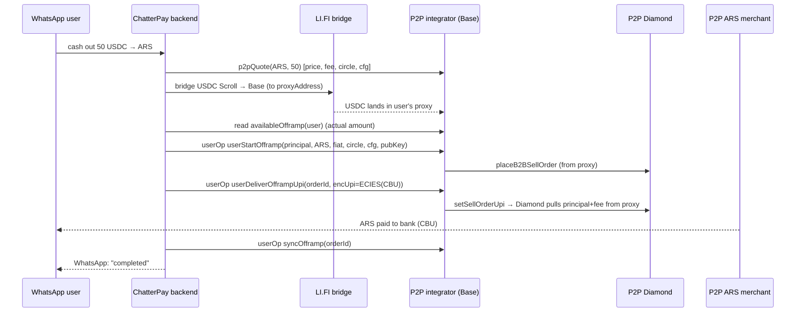

# Proposal: ChatterPay → P2P Off-ramp (USDC → ARS) Integration

| | |
|---|---|
| **Status** | Draft for discussion |
| **Audience** | P2P (payment-integrators) + ChatterPay / P4-Games backend |
| **Scope** | Off-ramp **only** (crypto → fiat). On-ramp is out of scope. |
| **Corridor** | USDC → **ARS** (Argentina). P2P confirms ARS merchant/payout liquidity exists. |
| **Author** | P2P integrations |
| **Based on** | `github.com/P4-Games/ChatterPay-Backend` (public, `main`) and P2P `feat/offramp-v2` |

---

## 1. Executive summary

ChatterPay wants to let its WhatsApp users cash out crypto to Argentine pesos through P2P's off-ramp network. This is **very feasible and unusually low-friction**, because:

1. **ChatterPay is already ramp-shaped.** It ships a provider-based ramp abstraction (`/ramp/*` routes) with one provider wired in today (**Manteca**, an Argentine ARS ramp). Adding P2P is "add a second off-ramp provider," not "build ramps."
2. **ChatterPay can act as the user's on-chain agent.** It runs full ERC-4337 account abstraction and **custodies the per-user signing key**, submitting gas-sponsored UserOperations on the user's behalf. Its smart account exposes a generic `execute(dest, value, func)`, so it can drive *any* P2P contract call the user would normally make.
3. **P2P's v2 off-ramp is user-driven and non-custodial.** The user funds their own per-user proxy and drives the SELL; P2P never holds the funds. ChatterPay-as-agent slots into the "user" role naturally.
4. **The ARS corridor exists on P2P's side** — the one true business prerequisite is satisfied.
5. **Zero-KYC by design.** The P2P off-ramp requires **no end-user identity verification** — the user keeps custody and supplies only an (encrypted) payout destination. This matches the commitment made to ChatterPay and is simply how the P2P protocol works; any merchant-side regulatory obligations live entirely inside the P2P merchant network and never touch the ChatterPay user flow. It is also a differentiator vs. the Manteca path (KYC documents + tiered limits).

There are **three mismatches to bridge**, none blocking:

| Mismatch | ChatterPay today | P2P today | Resolution |
|---|---|---|---|
| **Chain** | Scroll | Base | Bridge USDC Scroll → Base via ChatterPay's existing LI.FI integration |
| **Custody model** | Manteca = custodial "deposit & forget" | v2 = non-custodial, user-driven | New ChatterPay-specific integrator; user self-funds proxy (recommended) |
| **Asset backing** | n/a | TradeStars v2 allocation is **Solana-burn-backed** | New integrator drops Solana/vault; user's own bridged USDC backs the off-ramp |

**Recommended approach:** a new, lean **`ChatterPayOfframpIntegrator`** on Base (sibling to TradeStars/Piker), reusing v2's audited user-driven lifecycle but **self-funded** (no relayer, no vault, no Solana burn) and with a **refund path**. On the ChatterPay side, a new `services/p2p/` provider plus a P2P branch in the existing ramp controller.

---

## 2. Background

### 2.1 ChatterPay (what we're integrating with)

- **Product:** a WhatsApp wallet ("Chatizalo" bot). Users are keyed by `phone_number`; each user has `wallets[].wallet_proxy` (the 4337 smart account) and `wallet_eoa`.
- **Stack:** Bun + Fastify + MongoDB + ethers.js. Full ERC-4337: bundler / paymaster / userOp services under `src/services/web3/`.
- **Key custody:** the backend builds an `ethers.Wallet` signer per user (`src/services/walletService.ts`) and submits **paymaster-sponsored UserOperations** on the user's behalf. **This is the linchpin** — ChatterPay's backend can execute arbitrary contract calls *from the user's smart account*.
- **Chain:** default **Scroll** (`DEFAULT_CHAIN_ID = 534351` Scroll Sepolia; `ONRAMP_DEFAULT_NETWORK = 'scroll'`). Config includes **Base Sepolia (84532)** in the testnet list, and the codebase already has **LI.FI cross-chain** (`src/services/crossChainService.ts`, "Source network config (Scroll)" → destination chain) and an **Alchemy deposit ingestor** (`src/services/alchemy/depositIngestorService.ts`).
- **Per-chain accounts — addresses are NOT the same across chains (verified).** The user's signing key is derived as `sha256(secret + chainId + secret + phone)` (`secService.get_up(phone, chainId)`, called from `src/services/web3/contractSetupService.ts:23`), and wallets are stored **per chain** (`getUserWalletByChainId`, `wallets[]` keyed by `chainId`). Because **`chainId` is an input to the key derivation**, a user's owner EOA — and therefore their 4337 smart-account address — is **different on Base than on Scroll**. There is no cross-chain address parity. Both accounts are ChatterPay-controlled (the backend can derive either key on demand), so this is a provisioning fact, not a blocker.
- **Existing ramp surface:** `src/api/rampRoutes.ts` exposes `/ramp/off`, `/ramp/on`, `/ramp/linkToOperate`, plus balance / limits / KYC-document endpoints. Provider = Manteca (`src/services/manteca/**`). Off-ramp model (`MantecaRampOff` in `src/types/mantecaType.ts`) is a 3-stage synthetic op: **DEPOSIT** crypto → **ORDER** SELL USDC→ARS → **WITHDRAW** ARS to a bank account (CBU/CVU/alias). **Most of `rampController.ts` is currently mocked**, so there is room to make P2P a first-class path.
- **Generic call primitive (verified):** the account ABI has `execute(address dest, uint256 value, bytes func)`. Today the backend only wraps ERC-20 transfers (`createTransferCallData` in `src/services/web3/userOpService.ts`); a generic "call arbitrary method" helper is a few lines on top of the same `execute`.
- **Bank-account capture (verified):** `/ramp/user/:userId/bankaccount/ars` already exists for binding ARS CBUs — reusable for P2P payout details.

### 2.2 P2P off-ramp v2 (what ChatterPay calls into)

From `TradeStarsCheckoutIntegratorV2` (`feat/offramp-v2`), the off-ramp is **user-driven** with a single relayer touch:

- `allocateOfframp(user, amount, solanaBurnTx, …)` — **relayer-only**, pulls from a vault, gated on a **Solana burn**. TradeStars-specific; **not used by ChatterPay.**
- `userStartOfframp(principal, currency, fiatAmount, circleId, cfgId, userPubKey)` — `msg.sender` is the user; the contract derives the **per-user proxy** via `_ensureProxy(msg.sender)`, requires the **proxy** to hold `principal + fee`, and places a SELL on the Diamond.
- `userDeliverOfframpUpi(orderId, encUpi)` — order owner delivers the **encrypted payout details**; the Diamond pulls `principal + fee` from the proxy.
- `syncOfframp(orderId)` — permissionless terminal-status reconcile (clears the in-flight slot).
- `availableOfframp(user)` = **raw USDC balance of the user's proxy**.

**Key property we exploit:** the proxy balance is just raw USDC — funds transferred directly to the proxy address are cashable. So a user can **fund their own proxy with a plain ERC-20 transfer** and skip `allocateOfframp` and the relayer entirely. For ChatterPay — where the funds are the user's own, not Solana-burn-backed — that is exactly the desired behavior.

---

## 3. Why it fits

In P2P's model, ChatterPay's backend **is the user's wallet agent**. When ChatterPay submits a UserOperation, `msg.sender` to our integrator is the user's ChatterPay smart account. Therefore:

- `userStartOfframp` / `userDeliverOfframpUpi` / `syncOfframp` can all be driven by ChatterPay as UserOperations — exactly like its existing `sendTransferUserOperation`, just with different calldata.
- The user's **Base** ChatterPay account is the "user" identity in P2P (it is `msg.sender` on Base), and our per-user proxy derives deterministically from it. This is a **different address** than the user's Scroll account (chainId is in ChatterPay's key derivation — see §2.1), but both are ChatterPay-controlled: the backend signs the Scroll-side bridge with the Scroll key and the Base-side off-ramp userOps with the Base key.
- Gas is sponsored by ChatterPay's paymaster (their existing model), so the user flow stays gasless.

---

## 4. Proposed architecture (recommended: non-custodial)

### 4.1 Components

**P2P side — new contract `ChatterPayOfframpIntegrator` (Base):** a lean fork of v2.

- **Reused verbatim:** `userStartOfframp` → `userDeliverOfframpUpi` → `syncOfframp`, the per-user proxy, fee-from-balance (no float subsidy), one-in-flight guard, keeper-driven expiry recovery.
- **Removed:** `allocateOfframp`, the Solana burn dedup, the yield vault, the off-ramp relayer. The user self-funds the proxy.
- **Added:**
  - `userReclaimProxyFunds(uint256 amount)` — returns idle proxy USDC to `msg.sender` (the ChatterPay account). **Safe and important here** because the funds are user-owned (no burn backing to double-spend). This closes the "funds stuck in proxy if the corridor is briefly down" gap that v2 intentionally left for the burn-backed TradeStars case.
  - *(optional)* `userFundAndStart(...)` — `transferFrom`s USDC from `msg.sender` into the proxy and places the SELL in one call (needs a prior `approveToken`). Saves a round-trip vs. transfer-then-start.
- Deployed on Base and registered on the Diamond (`registerIntegrator`, `proxyImpl` set-once — same as every other integrator).

**ChatterPay side — new `services/p2p/` provider** mirroring `services/manteca/`, plus a P2P branch in `rampController.rampOff`:

- `p2pQuoteService` — fetch ARS sell price, fee, `circleId`, `cfgId`, small-order threshold (mirrors `mantecaPriceService` / `getRampCryptoPairPrices`).
- `p2pOfframpService` — orchestrate bridge → fund proxy → start → deliver → sync.
- `p2pPayoutService` — ECIES-encrypt the user's CBU into `encUpi` (per-user relay identity from the P2P SDK).
- Token entry on Base with `ramp_enabled = true`, provider = `p2p`.

### 4.2 Flow (end-to-end)

```
ChatterPay user (WhatsApp)
        │  "cash out 50 USDC to my bank"
        ▼
ChatterPay backend (Bun/Fastify, custodies user key)
        │  1. p2pQuote(ARS, 50)  ──────────────►  P2P quote API/SDK  (price, fee, circleId, cfgId)
        │  2. LI.FI bridge: Scroll-acct USDC ─►  Base, dest = proxyAddress(Base acct)
        │     (Scroll & Base accounts are DIFFERENT addrs; both ChatterPay-controlled)
        │  3. read availableOfframp(user)  ◄───  Base integrator  (use ACTUAL delivered amount)
        │  4. userOp: userStartOfframp(principal, ARS, fiatAmount, circleId, cfgId, userPubKey)
        │  5. poll order status
        │  6. userOp: userDeliverOfframpUpi(orderId, encUpi = ECIES(CBU))
        │  7. userOp: syncOfframp(orderId)   ; write transactionModel ; WhatsApp notify
        ▼
P2P Diamond + per-user proxy (Base)
        │  pulls principal+fee from proxy on SELL settlement
        ▼
P2P circle merchant ──── pays ARS to user's CBU/CVU/alias
```



### 4.3 Operational details that matter

- **Use the delivered amount, not the requested amount.** LI.FI fees/slippage mean the proxy may receive slightly less than 50 USDC. ChatterPay must compute `principal` from `availableOfframp(user)` *after* the bridge settles, or `userStartOfframp` reverts on the `principal + fee` balance check.
- **Retry-on-cancel is normal.** A SELL that isn't taken expires (≈3 min PLACED) and the P2P keeper (`autoCancelExpiredOrders`) cancels it; the USDC never moved (it's still in the proxy). ChatterPay's poller should treat CANCELLED as "re-place," not "failed." Funds are always safe in the proxy.
- **One in-flight draw per user.** The prior order must be terminal before the next `userStartOfframp`. Partial cash-outs are supported (draw any principal ≤ proxy balance, in parts).
- **Payout details are currency-agnostic.** `encUpi` is an opaque encrypted string — UPI for India, **CBU/CVU/alias for Argentina**. ChatterPay reuses its existing ARS bank-account binding to source it.
- **Provision the Base account first.** Because the Base account address differs from Scroll (chainId is in the key derivation), ChatterPay must derive/deploy the user's **Base** account before `proxyAddress(...)` is even known. The user model already supports per-chain wallets, so this is a provisioning step, not a data-model change.
- **Refund path.** If the user abandons or the corridor is down, `userReclaimProxyFunds` returns the USDC to the user's Base ChatterPay account (then optionally bridge back to Scroll).

---

## 5. Alternative considered: custodial REST facade (Option B)

P2P could instead expose a **hosted, Manteca-style REST off-ramp** (deposit address → P2P operates the SELL → P2P pays ARS). ChatterPay would integrate it almost identically to Manteca (minimal backend work — just an HTTP client + provider shim).

**Trade-off:** simpler for ChatterPay, but it **reintroduces custody and a relayer-driven lifecycle** — precisely what P2P's v2 redesign removed. P2P would transiently hold user USDC and operate orders on the user's behalf, with the associated trust, float, and compliance surface.

**Recommendation: Option A (non-custodial).** It preserves v2's properties, keeps P2P out of custody, and ChatterPay's account-abstraction stack makes the "extra" on-chain orchestration cheap (it already builds and submits userOps). Option B remains a fallback if ChatterPay wants zero contract integration for a fast pilot. **This is an open decision — see §8.**

---

## 6. Work breakdown

### 6.1 P2P side
1. `ChatterPayOfframpIntegrator.sol` — fork v2; drop allocate/vault/Solana; add `userReclaimProxyFunds` (+ optional `userFundAndStart`).
2. Tests to the **80% branch-coverage gate**; deploy to Base Sepolia; `registerIntegrator`.
3. **ARS corridor config** — circle(s), payment-channel config, small-order threshold, sell pricing for USDC→ARS.
4. Quote + status surface for ChatterPay (SDK method and/or REST): price/fee/circle/cfg + order status (poll now, **webhook later**).
5. SDK helper for ECIES payout encryption (or expose via `@p2pdotme/sdk`).

### 6.2 ChatterPay side
1. `services/p2p/` provider (quote / offramp / payout) mirroring `services/manteca/`.
2. P2P branch in `rampController.rampOff` (provider switch by token/config).
3. **Cross-chain orchestration** — reuse `crossChainService` (LI.FI) to bridge Scroll→Base to the proxy address; reuse the deposit ingestor to confirm arrival.
4. **Generic call helper** alongside `createTransferCallData` — encode `execute(integrator, 0, <method calldata>)` for the three user-driven calls.
5. **Base account provisioning** — derive/deploy the user's **Base** smart account (a *distinct* address from Scroll, since chainId is in the key derivation), store it as a per-chain wallet, and ensure the factory + paymaster are deployed and funded on Base. The P2P proxy and the bridge destination both key off this Base address.
6. Status polling + retry-on-cancel; `transactionModel` records; WhatsApp notifications; token entry (`ramp_enabled`, provider `p2p`) on Base.

### 6.3 Phasing
- **Phase 1 (P2P):** contract + corridor config + Base Sepolia deploy/register.
- **Phase 2 (P2P):** quote/status SDK + payout encryption.
- **Phase 3 (ChatterPay):** provider + ramp branch + bridge orchestration + notifications.
- **Phase 4 (joint):** testnet E2E (Scroll Sepolia + Base Sepolia), then a capped mainnet pilot.
- **Phase 5 (later):** P2P fraud/risk engine called per off-ramp transaction with the user's **phone number** for screening (a risk signal — *not* identity KYC; consistent with §1.5).

---

## 7. Risks & mitigations

| Risk | Impact | Mitigation |
|---|---|---|
| Bridge slippage vs. fee check | `userStartOfframp` reverts | Compute principal from `availableOfframp` post-bridge |
| No merchant takes the SELL | Order expires | Keeper auto-cancels; ChatterPay re-places; funds stay in proxy |
| User abandons mid-flow | USDC idle in proxy | `userReclaimProxyFunds` returns funds to the ChatterPay account |
| Base account not provisioned / paymaster unfunded | userOps fail | Provision the per-user **Base** account (own address — no Scroll parity) + fund paymaster on Base before pilot |
| ARS price volatility between quote and SELL | User gets unexpected rate | Short quote TTL; surface rate in WhatsApp confirmation |

---

## 8. Open decisions (for ChatterPay + P2P to confirm)

1. **Integration depth / custody** — *Recommended:* **Option A, non-custodial** (ChatterPay drives P2P contracts as the user's wallet). Confirm, or choose Option B (P2P-hosted custodial REST facade) for a faster, lower-effort pilot.
2. **Chain strategy** — *Recommended:* **bridge Scroll→Base** and reuse ChatterPay's LI.FI integration. (Deploying the full P2P/Diamond stack on Scroll is a large lift; P2P infra is Base-native.) Confirm.
3. **Gas sponsorship on Base** — ChatterPay's paymaster (extend/fund it on Base) vs. a P2P paymaster. Who sponsors the off-ramp userOps?
4. **Order status delivery** — start with **polling** (P2P subgraph/Diamond views) and add a **P2P → ChatterPay webhook** later? Confirm the interim approach.
5. **Base account provisioning policy** — the user's Base account is a *distinct* address from Scroll (chainId is in ChatterPay's key derivation — confirmed in `secService.get_up`), so the P2P identity binds to the **Base** account. Decide whether ChatterPay provisions Base accounts for all users up front or lazily on first off-ramp (and when the paymaster is funded for them).
6. **Limits & amounts (liquidity-based, not KYC-tiered)** — caps are **risk/liquidity** limits (the contract's `maxUsdcPerOfframp` + merchant capacity), *not* identity tiers. There is **no user KYC** (see §1.5). Confirm the per-off-ramp min/max and how they surface in ChatterPay's UX.

---

## Appendix A — Key interfaces

**P2P integrator (user-driven, called by the ChatterPay account via `execute`):**
```solidity
function userStartOfframp(
    uint256 principal, bytes32 currency, uint256 fiatAmount,
    uint256 circleId, uint256 preferredPaymentChannelConfigId, string calldata userPubKey
) external returns (uint256 orderId);
function userDeliverOfframpUpi(uint256 orderId, string calldata encUpi) external;
function syncOfframp(uint256 orderId) external;
function availableOfframp(address user) external view returns (uint256);
// new for ChatterPay:
function userReclaimProxyFunds(uint256 amount) external;     // refund idle proxy USDC to msg.sender
function userFundAndStart(/* … */) external returns (uint256 orderId); // optional convenience
```

**ChatterPay account primitive (verified in `ChatterPay.sol` ABI):**
```solidity
function execute(address dest, uint256 value, bytes calldata func) external; // generic call
```

## Appendix B — Reference pointers

- **ChatterPay backend:** `src/api/rampRoutes.ts`, `src/controllers/rampController.ts`, `src/services/manteca/**`, `src/types/mantecaType.ts`, `src/services/crossChainService.ts`, `src/services/transferService.ts`, `src/services/web3/userOpService.ts`, `src/services/web3/contractSetupService.ts` + `src/services/secService.ts` (per-chain key/account derivation), `src/services/alchemy/depositIngestorService.ts`, `src/config/constants.ts`.
- **P2P:** `contracts/integrators/tradestars/TradeStarsCheckoutIntegratorV2.sol` (`feat/offramp-v2`), `contracts/base/UserProxy.sol`, `contracts/interfaces/IP2PIntegrator.sol`, `docs/INTEGRATORS.md`.
