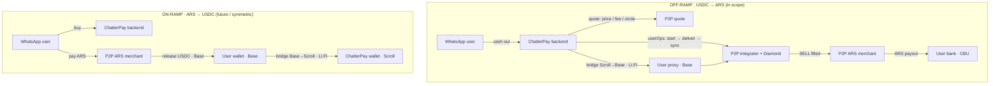

# ChatterPay × P2P Off-ramp — One-Pager (for sign-off)

**What:** let ChatterPay's WhatsApp users cash out **USDC → ARS** through P2P's off-ramp network.
**How:** non-custodial, **zero-KYC**; ChatterPay drives P2P contracts on Base as the user's wallet.
**Status:** draft for approval. Full technical detail: `docs/proposals/chatterpay-offramp-integration.md`.

---

## Proposed agreements — react 👍 / 👎 per row

| # | Topic | Proposal |
|---|-------|----------|
| 1 | **Scope** | Off-ramp only, **USDC → ARS** (Argentina). ARS payout liquidity exists on P2P. |
| 2 | **Custody** | **Non-custodial** — P2P never holds funds. User's USDC sits in their own per-user proxy; ChatterPay drives the SELL via gas-sponsored userOps. *(Alt: P2P-hosted custodial REST facade — faster, but reintroduces custody.)* |
| 3 | **Chain** | ChatterPay is on Scroll, P2P off-ramp is on Base → **bridge Scroll→Base via ChatterPay's existing LI.FI**. P2P stays Base-native. |
| 4 | **Zero-KYC** | **No end-user identity verification.** User keeps custody + supplies an encrypted payout destination (CBU). Any merchant-side obligations stay inside the P2P network. |
| 5 | **Identity** | P2P binds to the user's **Base** ChatterPay account (per-chain address, distinct from Scroll). ChatterPay provisions Base accounts + funds the paymaster on Base. |
| 6 | **Refund** | `userReclaimProxyFunds` returns idle funds to the user anytime — money is never stuck. |

---

## Request flows



**Off-ramp, step by step**

```
ChatterPay user (WhatsApp)
        │  "cash out 50 USDC to my bank"
        ▼
ChatterPay backend (Bun/Fastify, custodies user key)
        │  1. p2pQuote(ARS, 50)  ──────────────►  P2P quote API/SDK  (price, fee, circleId, cfgId)
        │  2. LI.FI bridge: Scroll-acct USDC ─►  Base, dest = proxyAddress(Base acct)
        │     (Scroll & Base accounts are DIFFERENT addrs; both ChatterPay-controlled)
        │  3. read availableOfframp(user)  ◄───  Base integrator  (use ACTUAL delivered amount)
        │  4. userOp: userStartOfframp(principal, ARS, fiatAmount, circleId, cfgId, userPubKey)
        │  5. poll order status
        │  6. userOp: userDeliverOfframpUpi(orderId, encUpi = ECIES(CBU))
        │  7. userOp: syncOfframp(orderId)   ; write transactionModel ; WhatsApp notify
        ▼
P2P Diamond + per-user proxy (Base)
        │  pulls principal+fee from proxy on SELL settlement
        ▼
P2P circle merchant ──── pays ARS to user's CBU/CVU/alias
```

> **Later phase:** each off-ramp call also hits P2P's fraud/risk engine with the user's **phone number** for per-transaction screening (a risk signal — *not* identity KYC).

---

## Work split

**P2P side**
- `ChatterPayOfframpIntegrator.sol` — fork v2; drop allocate/vault/Solana; add `userReclaimProxyFunds` (+ optional `userFundAndStart`).
- Tests to the 80% branch-coverage gate; deploy to Base Sepolia; `registerIntegrator`.
- ARS corridor config — circle(s), payment-channel config, small-order threshold, sell pricing for USDC→ARS.
- Quote + status surface for ChatterPay (SDK and/or REST): price/fee/circle/cfg + order status (poll now, webhook later).
- SDK helper for ECIES payout encryption (or expose via `@p2pdotme/sdk`).

**ChatterPay side**
- `services/p2p/` provider (quote / offramp / payout) mirroring `services/manteca/`.
- P2P branch in `rampController.rampOff` (provider switch by token/config).
- Cross-chain orchestration — reuse `crossChainService` (LI.FI) to bridge Scroll→Base to the proxy; reuse the deposit ingestor to confirm arrival.
- Generic call helper alongside `createTransferCallData` — `execute(integrator, 0, <calldata>)` for the three user-driven calls.
- Base account provisioning — derive/deploy the user's Base smart account (distinct address; chainId is in the key derivation), store as a per-chain wallet, fund the paymaster on Base. Proxy + bridge destination key off this Base address.
- Status polling + retry-on-cancel; `transactionModel` records; WhatsApp notifications; token entry (`ramp_enabled`, provider `p2p`) on Base.

---

## Phasing

1. **P2P** — contract + corridor config + Base Sepolia deploy/register.
2. **P2P** — quote/status SDK + payout encryption.
3. **ChatterPay** — provider + ramp branch + bridge orchestration + notifications.
4. **Joint** — testnet E2E (Scroll Sepolia + Base Sepolia) → capped mainnet pilot.
5. **Later** — P2P fraud/risk engine called per transaction with the user's phone number (risk signal, not KYC).

---

## To confirm
- **Gas sponsorship on Base** — ChatterPay paymaster vs. P2P paymaster.
- **Status delivery** — polling now, P2P→ChatterPay webhook later?
- **Base account provisioning** — up front for all users, or lazily on first off-ramp?
- **Limits** — per-off-ramp min/max (liquidity-based, *not* KYC tiers).
